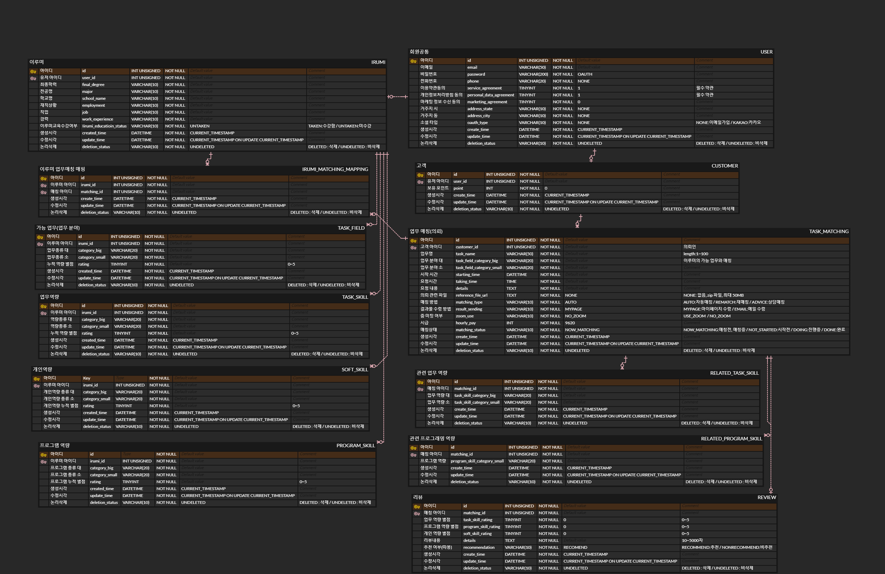

# 리뷰 시스템 설계

회원은 사무 용역을 제공하는 "이루미"와 해당 서비스를 이용하는 "고객"으로 크게 나뉜다.

하나의 회원이 하나의 역할만 맡을 수 있으나, "이루미" 역을 맡을 수도 있고 "고객"을 맡을 수도 있다. 둘 다 맡는 것도 가능하다.

"이루미"가 용역을 제공하고 "고객"은 리뷰를 남길 수 있다.

"이루미"는 "고객"에 대한 리뷰를 남길 수 없다.

---

## ToC

- [ERD 설계](.#erd-설계)
- [Entity 설계](.#entity-설계)
- [Project 구조](.#project-구조)
- [환경 설정](.#환경-설정)
- [API Doc](.#api-doc)

---

## ERD 설계



### USER

- 회원의 기본 정보를 담는다.

### CUSTOMER

- 포인트 정보가 있다. 이루미와 매칭되면 차감된다.

### IRUMI

- 이루미는 역량을 가진다. 역량은 카테고리 대, 소 다중 선택이 가능 
  - 각 역량 들은 별개의 테이블로 두었다.

- 하나의 이루미가 여러 역량을 지닐 수 있다.
  - IRUMI : \[역량 테이블\] = 1:N

- 하나의 의뢰(매칭)에 여러 이루미를 사용 할 수 있다. 한 명의 이루미가 여러 번 매칭 될 수 있다.
  -  TASK_MATCHING : IRUMI = N:M
  - JPA 엔터티 설계를 고려하여 매핑 테이블을 둔다.
    - TASK_MATCHING : IRUMI_MATCHING_MAPPING : IRUMI 1:N:1

### TASK_MATCHING

- 고객이 업무를 등록하면 TASK_MATCHING 이 생성된다.

- 하나의 고객이 여러 의뢰를 할 수 있다.
  - CUSTOMER : TASK_MATCHING = 1 : N

- 의뢰의 업무 분야와 역량 들을 기준으로 이루미가 매칭된다.

- 업무 매칭 여부를 나타내는 mached_status 가 있다.

- 하나의 의뢰(매칭)가 여러 이루미와 매칭 될 수 있다. 한명의 이루미가 여러 매칭을 할 수 있다.
  - TASK_MATCHING : IRUMI = N:M

  - JPA 엔터티 설계를 고려하여 매핑 테이블을 둔다.
  - TASK_MATCHING : IRUMI_MATCHING_MAPPING : IRUMI 1:N:1


### REVIEW

- 요청한 의뢰의 "업무 분야"를 제외한 "역량" 들에 별점이 매겨진다.

- 여러개의 세부 업무 역량과 세부 프로그래밍 역량이 각각 매겨지는 것이 아닌 것으로 설계했다.
  - 업무 역량 전체에 대해 한번에 평가 받고 연관된 역량을 찾아 이루미의 역량 테이블에 누적 역량 별점에 추가 된다.

---

## Entity 설계

- 실수로 기본생성자의 호출을 막기위해 다음 어노테이션을 사용

  - `@NoArgsConstructor(access = AccessLevel.PROTECTED)`

### RootEntity

모든 테이블에 공통적으로 존재하는 것들을 담는다. 모든 엔터티는 `RootEntity`를 상속 받는다.
- `createTime`
- `updateTime`
- `deletionStatus`

### User

- `User` 엔터티는 `Irumi`, `Customer`와 `OneToOne` 매핑했다.

- 연관 되는 필드를 묶어 `@Embeddable` 인 Address, Agreement 를 만들어 사용했다.

### Irumi

- `Irumi` 는 `TaskField`, `TaskSkill`, `SoftSkill`, `ProgramSkill` 네가지 역량과 `OneToOne` 매핑했다.

### Customer

- 고객은 리뷰를 작성할 수 있는 매칭 목록과 작성한 리뷰 목록을 볼 수 있어야 한다. 
  - `TaskMatching` 과 `OneToMany` 매핑을 둔다.

### TaskMatching

### Review

- 매칭 상태가 완료 된 상태에서만 고객이 이루미에게 리뷰를 남길 수 있다.

---

## Project 구조

### 패키지 구조

계층 구조 대로 패키지를 나누려고 했더니 ERD 상 대략 Entity 가 8개 인데 너무 복잡해질 것 같았다.  

유저(이루미 + 고객), 업무매칭, 리뷰의 도메인 별로 패키지를 나눈다. 각 도메인 별로 관련 된 코드들이 모이게 된다. (응집)

`global` 패키지에는 여러 도메인에 쓰이는 공통으로 쓰이는 부분이나, util 성 코드를 담아둔다.


### 데이터 흐름 구조

```
controller <-> service <-> repository(DAO)
```

---

## 환경 설정

### application.yml

```yml
spring:

  ...

  jpa:
    hibernate:      
      ddl-auto: none #  개발, 테스팅 시 create / update
    properties:
      hibernate:
        default_batch_fetch_size: 100 # 기본 배치사이즈 설정
    open-in-view: false # OSIV

  ...
```

- `defaut_batch_fetch-size` : collection fetch join 을 할 때, batch size: 100을 기본으로 설정했다.

- `open-in-view` :  view 까지 DB 와의 커넥션을 유지하는 것을 사용하지 않는다.

### dependancies

- [build.gradle](./blob/main/build.gradle)

---

## API Doc

- [docs](./doc)
